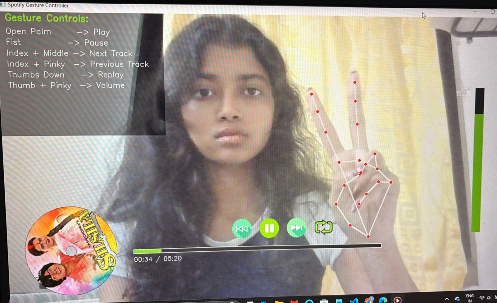
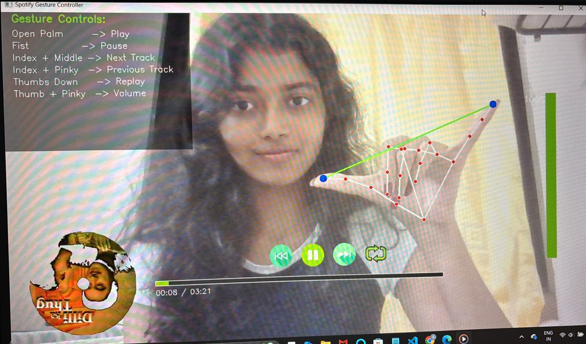

# 🎵 Spotify Gesture Controller

Control your Spotify playback using **hand gestures** with OpenCV, MediaPipe, and the Spotify Web API.

Use your webcam to:
- ✋ Play  
- ✊ Pause  
- 👉 Next / Previous track  
- 🔁 Replay  
- 🔊 Control volume by changing thumb–index distance  
- 📀 Watch a rotating vinyl disc made from album art  
- 🎚 View a vertical volume slider + Spotify-like progress bar  

## 📸 Screenshots

  

  

  

---

## ✨ Features

- 📀 **Rotating vinyl disc** created from Spotify album art  
- 🎶 **Real-time progress bar** synced with song progress  
- 🖐 **Gesture-based playback control**  
- 🎚 **Vertical volume bar**  
- 🎨 **Custom UI overlay** designed inside OpenCV  
- ⚙️ **Full integration with Spotify Web API** (requires Premium for some features)

---

## 🛠 Technologies Used

| Technology | Purpose |
|-----------|---------|
| **Python** | Core language |
| **OpenCV** | Drawing UI + capturing webcam frames |
| **MediaPipe** | Real-time hand landmark tracking |
| **Spotipy** | Sending playback commands to Spotify |
| **Pillow (PIL)** | Image processing for vinyl disc |
| **NumPy** | Fast math operations |
| **python-dotenv** | Loading Spotify API keys from `.env` |

---

## 🚀 Setup Instructions

1️⃣ Clone the Repository
git clone https://github.com/YOUR_USERNAME/spotify-gesture-controller.git
cd spotify-gesture-controller

2️⃣ Create Virtual Environment
python -m venv venv
venv\Scripts\activate     # Windows

3️⃣ Install Dependencies
pip install -r requirements.txt

4️⃣ Create a .env File for Spotify Credentials
Create a file named .env inside the project folder:

SPOTIPY_CLIENT_ID=your_client_id_here

SPOTIPY_CLIENT_SECRET=your_client_secret_here

SPOTIPY_REDIRECT_URI=http://127.0.0.1:8888/callback

Get these values from:
👉 https://developer.spotify.com/dashboard

5️⃣ Run the App
python spotify_controller.py

Your webcam window will open and start detecting gestures.

🎮 Gesture Controls (Cheat Sheet)
Gesture	Action
| Gesture                           | Action         |
| --------------------------------- | -------------- |
| ✋ **Open Palm**                   | Play           |
| ✊ **Fist**                        | Pause          |
| ☝️✌️ **Index + Middle extended**  | Next track     |
| 👍☝️✌️ **Thumb + Index + Middle** | Previous track |
| 🤟 **Ring + Pinky**               | Replay         |
| 👍☝️ **Thumb–Index distance**     | Volume control |

🎨 UI Showcase

📀 Rotating vinyl disc with album art

➕ Center control buttons (Play/Pause/Next/Previous/Replay)

📊 Spotify-style progress bar

🔊 Vertical volume slider

👋 Live hand landmark overlay

📁 Project Structure
spotify-gesture-controller/

│

├── spotify_controller.py

├── requirements.txt

├── README.md

├── .gitignore

└── .env   (ignored in GitHub)

🧩 Possible Future Improvements
Add pinch-to-seek progress control
Custom Spotify-themed UI skin
Hand tracking with ML model instead of rule-based detection
Multiple gesture modes (simple / advanced)

📝 License

MIT License.

IF YOU LIKE THIS PROJECT GIVE IT A STAR ON GITHUB WOULD MEAN A LOT THANKYOU!!!!
